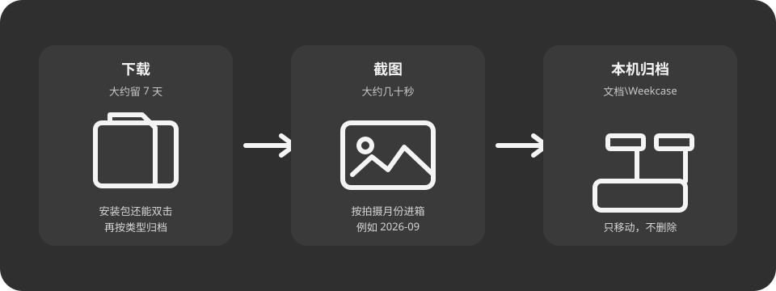
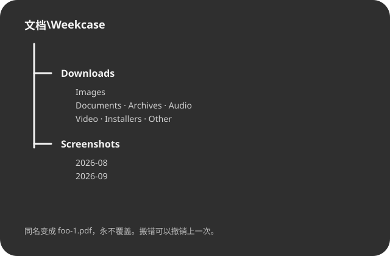

<p align="center">
  
</p>

# Weekcase

Windows 11 托盘小工具：把「下载」和「截图」里写完的文件 **移动** 到本机归档。

- **下载**大约留 **7 天**（刚下的安装包还能双击），再按类型分箱
- **截图**大约几十秒后，按月进 `Screenshots\2026-09`
- **第一次不会搬走已经堆着的旧文件**

只移动，不删除，不覆盖，不联网。搬错可以撤销上一次。名字不是按周分箱。

<p align="center">
  
</p>

**需要 Windows 11**（x64 与 ARM64）。不支持 Windows 10。

## 怎么用

解压后打开 `weekcase.exe`，托盘常驻，默认开机启动。第一次会确认归档根；路径在 OneDrive 下会警告。

要马上收旧文件：托盘 →「整理现有文件」。一次最多 256 个，多了再点一次。

想看效果：按 `Win+PrtSc` 拍一张，大约几十秒后打开归档文件夹。下载请按 7 天来，不要用它演示。

托盘还可以：暂停、撤销上一次、选择 / 打开归档目录、打开日志、重新加载配置、关掉开机启动。

卸载或删掉程序 **不会** 删掉已经归档走的文件。

## 归档长什么样

默认根：`文档\Weekcase`

<p align="center">
  
</p>

```text
文档\Weekcase\
  Downloads\
    Images\  Documents\  Archives\  Audio\  Video\  Installers\  Other\
  Screenshots\
    2026-08\
    2026-09\
```

下载只看最后一个点后面的扩展名。截图源里的文件一律当截图，即使叫 `foo.zip`。同名默认变成 `foo-1.pdf`。

<details>
<summary>下载扩展名怎么分</summary>

| 目录 | 扩展名 |
|------|--------|
| Images | png jpg jpeg gif webp bmp tif tiff heic heif svg |
| Documents | pdf doc docx xls xlsx ppt pptx txt md csv rtf odt ods odp epub |
| Archives | zip rar 7z tar gz tgz bz2 xz iso |
| Audio | mp3 wav flac aac m4a ogg wma |
| Video | mp4 mkv avi mov webm mpeg mpg wmv |
| Installers | exe msi msix appx cab |
| Other | 对不上的，包括没扩展名 |

完整规则见 [docs/features/02-classify.md](docs/features/02-classify.md)。

</details>

## 便携

exe 同目录放一份 `portable.ini`（内容会被忽略），配置和日志改到 `exe_dir\data\`。归档仍按你选的根目录，不跟 `data\` 走。

打包：

```powershell
powershell -File scripts/package.ps1
```

产出 `target\package\weekcase-portable.zip`（`weekcase.exe` + `portable.ini`）。

<details>
<summary>数据放哪</summary>

| 文件 | 普通安装 | 便携 |
|------|----------|------|
| `config.toml` | `%APPDATA%\Weekcase\` | `exe_dir\data\` |
| `state.json`、`undo.jsonl` | `%LOCALAPPDATA%\Weekcase\` | 同上 |
| 日志 | `%LOCALAPPDATA%\Weekcase\logs\`（1 MiB × 3） | 同上 |

</details>

<details>
<summary>构建</summary>

产品二进制需要 Windows + MSVC（Rust 1.80+）：

```text
cargo test --all
cargo build --release
```

Linux 上可以跑不依赖 Win32 的单测。

</details>

<details>
<summary>内存</summary>

干净 Win11 虚拟机、默认监视两源、空闲 5 分钟，任务管理器「内存」（Working Set）：stretch **12 MB**，发版硬上限 **20 MB**。12 MB 不是 CI 失败线。发版前：

```powershell
powershell -File scripts/measure-rss.ps1
```

</details>

## 规格

行为以这些文件为准：

| 文档 | 内容 |
|------|------|
| [docs/guide.md](docs/guide.md) | 从零讲解（不是规格） |
| [docs/design.md](docs/design.md) | 做什么 / 不做什么 |
| [docs/features/01-watch.md](docs/features/01-watch.md) | 监视、冷静期、稳定 |
| [docs/features/02-classify.md](docs/features/02-classify.md) | 分类与落点 |
| [docs/features/03-execute.md](docs/features/03-execute.md) | Move、冲突、撤销 |
| [docs/features/04-tray.md](docs/features/04-tray.md) | 托盘、开机启动 |
| [docs/features/05-first-run.md](docs/features/05-first-run.md) | 首次运行、整理现有、暂停 |

许可证：[MIT](LICENSE)
